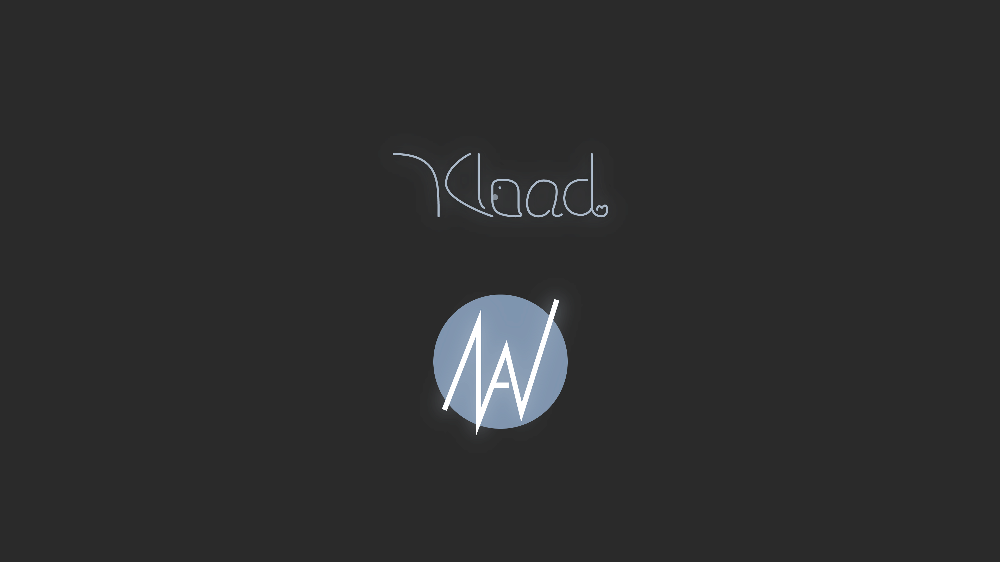

# Nav
 一个出自 [YKload](https://ykload.com) 的 Shell 风格的浏览器起始页。
 
 它提供了一个简洁、美观且功能丰富的界面，让用户可以快速进行搜索、查看时间日期，并享受丝滑动画和弹幕效果。

## 特性

1. 多搜索引擎支持：可选 百度、必应、Google 或 DuckDuckGo 进行搜索。
2. Ai搜索：支持使用 YKload 旗下的 [求索QiuSeek](https://qs.ykload.com) 进行高效Ai搜索。
3. 动态背景：支持风景（Bing 日图）和萌图（次元API）两种背景选项。
4. 联想弹幕：提供搜索联想功能，并以词云形式展示。
5. 时钟显示：实时显示当前时间和日期。
6. 自定义设置：用户可以根据个人喜好调整搜索引擎、背景和联想弹幕的设置。
7. 响应式设计：适配不同设备。
8. 完善的动画：各式各样丝滑的动画效果。

## 贡献

欢迎提交 Issues 或 Pull Requests 来帮助改进这个项目。

## 许可证

本项目采用 Apache License 2.0 许可证。详细信息请参阅 [LICENSE](LICENSE) 文件。
